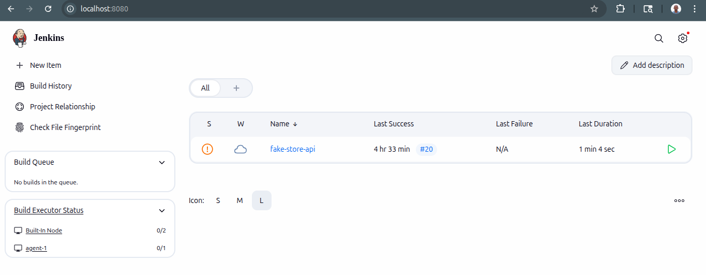

# 🧪 Automation Test Execution with Jenkins CI/CD

## Project Overview

This project seeks to help QA engineers have hands-on practice to set up a Jenkins pipeline to automatically trigger 
and execute tests upon code commits or scheduled builds. It simulates a real-world CI/CD setup where Jenkins pulls the 
latest test automation code from a Git repository, builds the project (if applicable), runs the test suite, and generates reports.

## Objectives

- Understand how CI/CD supports test automation
- Learn how to create Jenkins jobs or pipelines for testing
- Automate code pulls, test execution, and reporting in Jenkins
- Integrate reports and basic alerting in Jenkins

## Tasks

1. A working test suite
    - API tests [here](https://fakestoreapi.com/) using REST Assured
2. Host code in a GitHub repo:
    - Code should include a README.md, test files, and a Dockerfile
3. Set up Jenkins:
    - Install Jenkins locally or run via Docker (jenkins/jenkins:lts)
    - Install required Jenkins plugins (e.g., Git, Pipeline, HTML publisher, JUnit, etc.)
4. Configure a Jenkins Pipeline Job:
    - Pull code from the repo
    - Build and install dependencies
    - Run tests automatically
    - Archive and publish test reports
5. Webhook and notification:
    - Add webhook to trigger job on push 
    - Add Slack/email notifications 
    - Use [Jenkinsfile](./Jenkinsfile) (declarative or scripted)

## How to set it up?

1. Install the following before anything:
   - Docker (installation guide page)
   - IDEA (`IntelliJ` | `VS Code`)
2. Fork the [repo](https://github.com/sntakirutimana72/ci-e2e-test-automation.git) to your own GitHub (You can delete it after you're done)
3. Clone your forked version to your local machine
    ```bash
    git clone <YOUR_REPO_URL>
    ```
4. Open the repo you just cloned with one of the IDEA mentioned above
5. Open IDEA-builtin terminal
6. Switch to `api-testing-jenkins-ci` branch
    ```bash
    git checkout api-testing-jenkins-ci
    ```
7. Build & run jenkins ecosystem from the docker-compose.yml
    ```bash
    docker compose up -d --build jenkins-controller
    ```
8. Open your browser and visit `http://localhost:8080`, you should see a jenkins dashboard opening up
   
9. Install jenkins plugins (including `Slack Notification`, `GitHub Plugin`, `Pipeline Utility Steps`, `Credentials Plugin`) via `http://localhost:8080/manage/pluginManager/`
10. Add necessary environment credentials via `https://jenkins-hub.onrender.com/manage/credentials/`
    - `github-token` ~ Your GitHub personal access token with `repo` scope
    - `slack-token` ~ Your Slack bot token with `chat:write` scope (if you wish to use Slack notifications)
    - `gh-user` ~ Your GitHub username
